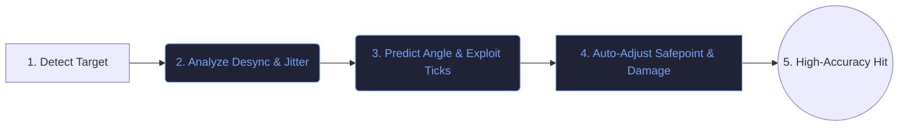

# NIGHTSENSE

> Advanced resolver and ragebot automation for Neverlose.cc

---

## 🗺️ How It Works (User Flow)

This simplified flow shows how NightSense helps you hit desyncing players:

---

## Project Metadata & Support

* **Developer:** ImSynZx
* **Discord Server Support:** [Join Server](https://discord.gg/kg6udfrA3p)
* **Official Sources:**
  * **Azura:** https://azura.uno/market?id=c7cfdb4e-5b00-41f0-833a-e6b25262152b&type=script
  * **GitLab:** https://gitlab.com/ntduckien1/neverlose-support
  * **GitHub:** https://github.com/ImSynZx/Neverlose-Lua